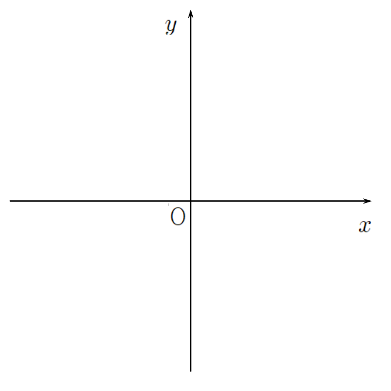

# 바탕화면 정리

### 문제 링크
https://school.programmers.co.kr/learn/courses/30/lessons/161990

### 문제 요약
최소한의 이동거리를 갖는 한 번의 드래그로 모든 파일을 선택해서 한 번에 지우려고 한다.

### 풀이 시간
42분

### 풀이 과정
문제의 핵심은 첫 드래그(격자점 S(lux, luy))와 드래그(격자점 E(rdx, rdy))를 떄는 점을 구하는 것이다. <br> 
학교에서 배웠던 그래프에 이 문제를 대입해 보면, S(최소 y값, 최소 x값), E(최대 y값 + 1, 최대 x값 + 1)이다. <br>


### 소스 코드
```cs
namespace Level1
{
    internal class 바탕화면_정리
    {
        public int[] solution(string[] wallpaper)
        {
            int[] S = new int[2] { 51, 51 };
            int[] E = new int[2] { -1, -1 };

            for (int i = 0; i < wallpaper.Length; i++)
            {
                for (int j = 0; j < wallpaper[i].Length; j++)
                {
                    if (wallpaper[i][j] == '#' && S[0] > i)
                    {
                        S[0] = i;
                    }
                    if (wallpaper[i][j] == '#' && S[1] > j)
                    {
                        S[1] = j;
                    }
                    if (wallpaper[i][j] == '#' && E[0] < i)
                    {
                        E[0] = i;
                    }
                    if (wallpaper[i][j] == '#' && E[1] < j)
                    {
                        E[1] = j;
                    }
                }
            }

            return new int[] { S[0], S[1], E[0] + 1, E[1] + 1 };
        }
    }
}
```

### 느낀점
고등학교 2학년 때 선배가 이중 for문과 이중 if 문에 대해 남발하는 건 보기에도, 성능에도 <br> 좋지 않다는 말을 한적이 있어 궁금해서 문제를 풀던 도중 찾아보게 되었다. <br>

먼저 이중 for문의 경우 성능에서는 레지스터가 한 번에 읽어드릴 수 있는 메모리의 양에 한계가 있어, <br> 밖의 for문은 가능한 크기가 작은 객체로 구성하는 게 성능면으로 좋다. <br>

또한 전에 이중 for문의 시간복잡도에 대한 성능 개선 문제를 푼 경험이 기억나 이것도 함께 찾아보았다. <br> 
빅오 표기법의 경우 n번만큼 반복하는 이중 for문이 있으면 시간 복잡도는  O(n²)이다. <br>
그렇다면 작성한 이중 for문의 경우는 O(wallpaper 배열 길이 x wallpaper 길이)가 된다. <br>
O(n)과 O(n²)은 매우 큰 성능 차이가 난다고 한다. <br>
다행이 이 문제는 성능에 대해 빡빡한 편이 아니라 그냥 넘어갔지만, 나중에 꼭 공부를 해야겠다.

다음으로 이중 if문의 경우에는 성능에는 크게 문제가 되지 않는다고 한다. <br>
다만 if를 무식하게 사용하는 것 보다 최소한의 비교로 원하는 값을 빠르게 찾는 것이 낫다고 하였다. <br>
예를 들어 무조건 숫자 하나하나씩을 차례로 검사하는 대신, <br> 먼저 숫자가 양수인지, 0인지, 음수인지를 먼저 검사하고, 그 이후에 숫자에 대한 검사를 진행하는 것이 낫다고 한다.

보통 이런 for, if 문 떡칠 코드를 보게 되면 보기에 좋지 않다는 생각이 먼저 들기 마련이다. <br>
그래서 마지막으로 클린 코드에 대해서 찾아보았다. <br>
우선 클린 코드는 원하는 로직을 빠르게 찾을 수 있는 코드, 모든 팀원들이 이해하기 쉽도록 작성된 가독성이 좋은 코드를 뜻한다. <br>
이러한 클린코드를 잘 작성하기 위해서는 먼저 변수, 함수명을 무슨 기능을 하는지 정확히 적어야 한다. <br>
또한 UML을 사용하거나 네이밍 컨벤션을 정하는 것도 좋다고 한다. <br>

이번 문제는 어렵거나 시간이 걸릴만한 문제는 아니였던것 같다. <br>
문제를 읽는데 조금 시간이 걸린것과, 잠시 해멘것을 제외하면 사실 다른 생각들에 사로잡혀 잠시 길을 헤매 시간이 더 걸렸던 것 같다. <br>
좋게 생각하면 지금 작성하고 있는 코드가 옳은 것인지 판단하는 좋은 시간이었지만, 나쁘게 말하면 그저 잡생각이 너무 많은 것 같다. <br>
내일 부터는 다른 잡 생각은 지우고 오직 문제에만 집중하여 풀어볼 생각이다. <br>